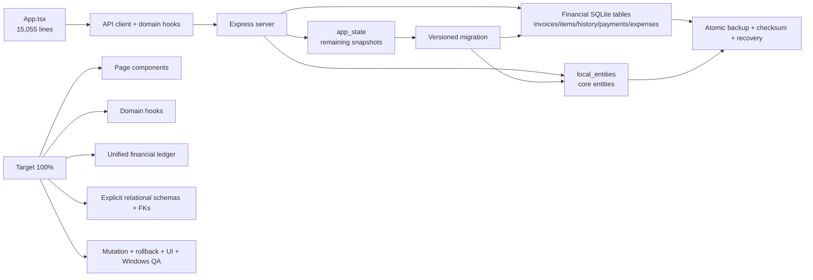

# AXIS LAB OS — العرض التوضيحي لحالة الدين التقني

## الملخص التنفيذي

النسخة الحالية في فرع المعالجة بعد نجاح Grill Me البرمجية والمالية. تم خفض المخاطر الأكبر في التخزين المحلي، وأصبحت قاعدة SQLite تستخدم schema version 3 مع جداول منظمة للكيانات الأساسية والفواتير وبنود الفواتير وتاريخها والمدفوعات والمصروفات. ما زال العمل مستمرًا لأن `src/App.tsx` يحتوي تقريبًا على 15,055 سطرًا، ولأن بعض collections التشغيلية غير المالية لا تزال تحتاج فصلًا كاملًا عن snapshot القديم.

## لوحة القياس الحالية

| المجال | الحالة الحالية | التقييم المرحلي | شرط 100% |
|---|---|---:|---|
| SQLite integrity وbackup/restore | ناجح مع corruption recovery | 95% | اختبارات crash وforeign-key وmigration متعددة الإصدارات |
| الكيانات الأساسية | `local_entities` مع migration من `app_state` | 95% | جداول relational صريحة وقيود مرجعية لكل domain |
| الفواتير | `local_invoices` مع payload متوافق | 90% | قراءة وكتابة API مباشرة من الجداول دون in-memory authority |
| بنود الفواتير والتاريخ | جداول مستقلة مع foreign key | 90% | اختبارات تعديل/إلغاء/credit note مع rollback ذري |
| المدفوعات | `local_payments` مع جمع payments من invoices/orders | 85% | ledger موحد وربط صريح بالفاتورة والطلب ومنع التكرار |
| المصروفات | `local_expenses` مع migration | 90% | قيود مبالغ وتواريخ واختبارات إغلاق الفترة |
| App.tsx | استخراج API وlocalStorage والمواد والشارات | 72% | تقسيم إلى صفحات ومكونات وhooks/domain services |
| API والاختبارات | lint وsmoke وmigration وWindows QA ناجحة | 94% | تغطية mutations والحالات السلبية والـ UI smoke |

## ما تم إصلاحه

تم إصلاح ازدواجية التخزين للكيانات المحلية عبر `local_entities`، وإضافة migration آمن من `app_state`. كما تم إنشاء جداول مالية مستقلة للفواتير وبنودها وتاريخها والمدفوعات والمصروفات، وإدخالها في عملية الحفظ الذرية والتحميل والاستعادة. أضيف اختبار migration يزرع قاعدة قديمة ثم يتحقق من البيانات عبر API ومن الجداول الجديدة مباشرة.

على مستوى الواجهة، تم استخراج عميل API الآمن، وhook عام لـ localStorage، وتصنيف المواد، وشارات حالات الطلب والدفع. هذه تغييرات منخفضة المخاطر؛ الهدف التالي هو نقل منطق الصفحات والعمليات إلى hooks وcomponents domain-specific.

## خريطة المعمارية الحالية والمستهدفة

## الطريق إلى 100%

المرحلة الأولى هي جعل الفواتير والمدفوعات مصدر الحقيقة من الجداول المحلية بدل أن تكون arrays داخل الذاكرة مع مزامنة لاحقة. يجب تنفيذ read/write adapters لكل mutation، بحيث تصبح عملية إنشاء الدفع أو credit note transaction واحدة تشمل invoice وitems وhistory والـ payment والـ activity log.

المرحلة الثانية هي إنهاء تفكيك `App.tsx`. سيتم فصل صفحات Dashboard وOrders وAccounting وInventory وProduction، ثم نقل state orchestration إلى hooks مستقلة، مع إبقاء المكونات الحالية كواجهات مؤقتة أثناء الاختبار.

المرحلة الثالثة هي توسيع الاختبارات إلى حالات الفشل: duplicate payment، payment أكبر من المتبقي، إلغاء فاتورة مدفوعة، credit note جزئي، فشل منتصف transaction، استعادة backup بين schema versions، وتزامن طلبين متعارضين.

المرحلة الأخيرة هي تشغيل Grill Me محليًا وعلى Windows، ثم قياس كل بند في الجدول. لن تعتبر النتيجة 100% إلا إذا نجح كل اختبار ولم تبقَ collection مالية تعتمد على in-memory authority أو snapshot غير مبرر.

## تعريف النجاح النهائي

> الجاهزية 100% تعني أن البيانات المالية لا تفقد أو تتضاعف بعد restart أو restore، وأن كل mutation محاسبية ذرية وقابلة للتراجع، وأن App.tsx لم يعد مسؤولًا عن orchestration شامل، وأن Windows unpacked والمثبتين ينجحان على بيئة نظيفة.
